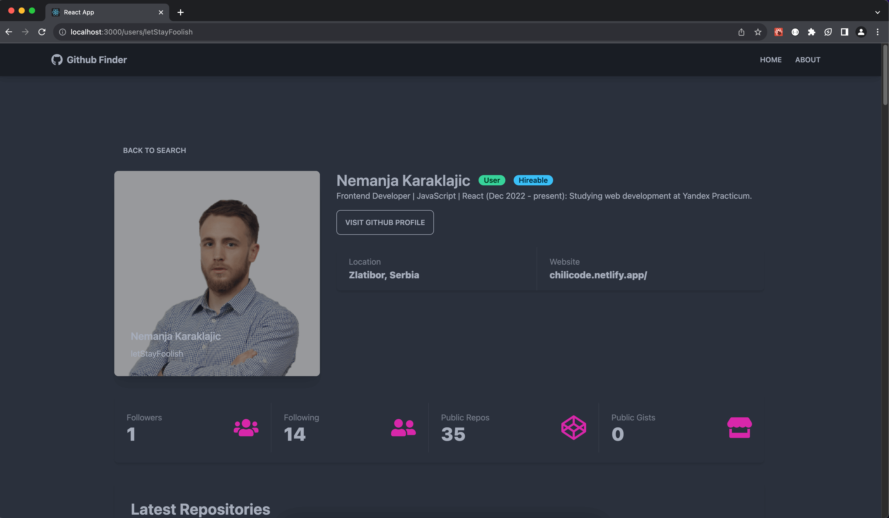

[//]: # ([![Contributors][contributors-shield]][contributors-url])

[//]: # ([![Forks][forks-shield]][forks-url])

[//]: # ([![Stargazers][stars-shield]][stars-url])

[//]: # ([![Issues][issues-shield]][issues-url])

[//]: # ([![MIT License][license-shield]][license-url])

[//]: # ([![LinkedIn][linkedin-shield]][linkedin-url])


<!-- PROJECT LOGO -->
<br />
<div align="center">
  <a href="https://github-finder-app-omega-six.vercel.app/" target="_blank">
    
  </a>

<h3 align="center">GitHub Finder</h3>

  <p align="center">
    Find GitHub users and display their info
    <br />
    <a href="https://github.com/letStayFoolish/github-finder-app"><strong>Explore the docs »</strong></a>
    <br />
    <br />
    <a href="https://github-finder-app-omega-six.vercel.app/">View Demo</a>
    ·
    <a href="https://github.com/letStayFoolish/github-finder-app/issues">Report Bug</a>
    ·
    <a href="https://github.com/letStayFoolish/github-finder-app/issues">Request Feature</a>
  </p>
</div>


<!-- TABLE OF CONTENTS -->
<details>
  <summary>Table of Contents</summary>
  <ol>
    <li>
      <a href="#about-the-project">About The Project</a>
      <ul>
        <li><a href="#built-with">Built With</a></li>
      </ul>
    </li>
    <li>
      <a href="#getting-started">Getting Started</a>
      <ul>
        <li><a href="#prerequisites">Prerequisites</a></li>
        <li><a href="#installation">Installation</a></li>
      </ul>
    </li>
    <li><a href="#usage">Usage</a></li>
    <li><a href="#license">License</a></li>
    <li><a href="#contact">Contact</a></li>
  </ol>
</details>


<!-- ABOUT THE PROJECT -->
## About The Project


Simple application based on React. At first, type username or login to search user/users. Then You can click on "View profile" to get onto selected user's page. On selected user page, you get information like:
 - Profile picture;
 - Profile full name;
 - Login;
 - Twitter address;
 - Webpage address;
 - Information about repositories, forks, stars and more...

Also, you can click on "clear" so you clear users from the search page.


### Built With

As mentioned earlier, this application is written on React, using `create-react-app`.

[![React][React.js]][React-url]

- React JS:
    - Create React App;
    - JSX;
    - Functional components;
    - Hooks.

<p align="right">(<a href="#readme-top">back to top</a>)</p>

<!-- GETTING STARTED -->
## Getting Started

To get a local copy up and running, follow these simple example steps.

### Prerequisites

* npm
  ```sh
  npm install npm@latest -g
  ```

### Installation

Clone repository:

    git clone https://github.com/letStayFoolish/github-finder-app
You can do it just by click [here](https://github.com/letStayFoolish/github-finder-app).

Install dependencies:

`npm install`

Run app:

`npm run start`

Build app (production):

`npm run build`

<p align="right">(<a href="#readme-top">back to top</a>)</p>


<!-- USAGE EXAMPLES -->
## Screenshots

See examples of pages (routes) while using this app. 


<details><summary><b>Show all</b></summary>



</details>

<hr>

<p align="right">(<a href="#readme-top">back to top</a>)</p>

<!-- LICENSE -->
## License

Distributed under the MIT License.

<p align="right">(<a href="#readme-top">back to top</a>)</p>

<!-- CONTACT -->
## Contact

Nemanja Karaklajic - [linkedIn](https://www.linkedin.com/in/nemanjakaraklajic30111990/)

Project Link: [https://github.com/letStayFoolish/github-finder-app](https://github.com/letStayFoolish/github-finder-app)

<p align="right">(<a href="#readme-top">back to top</a>)</p>


<!-- MARKDOWN LINKS & IMAGES -->
<!-- https://www.markdownguide.org/basic-syntax/#reference-style-links -->
[React.js]: https://img.shields.io/badge/React-20232A?style=for-the-badge&logo=react&logoColor=61DAFB
[React-url]: https://reactjs.org/

